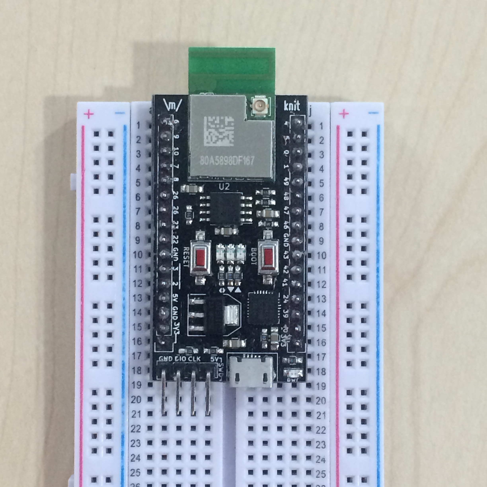

Makerville Knit
=======

[Pre Order >][preorder]

Knit is an industrial grade WiFi development board to build secure applications.


* 32-bit Cortex M4F at 200Mhz
* 512k RAM
* 4MB flash with XIP support
* 802.11 b/g/n with FCC, IC, CE certification
* On board USB to serial converter for programming and console
* Open source development using the GCC ARM toolchain, Eclipse IDE & OpenOCD debugger

The multiplexed peripherals include -

* 2 UARTs
* 25 GPIOs
* 2 I2C channels
* 7 PWM/GPT
* 2 SSPs
* 6 ADCs
* 1 DAC

Getting started
---------------

- Clone the SDK to your development machine

```
git clone https://github.com/marvell-iot/aws_starter_sdk
```
- Download the latest blob from the [releases](https://github.com/marvell-iot/aws_starter_sdk/releases) section

Pin Map
---

- Knit has 2 16 pin headers, which are breadboard friendly.
- We have a total of 25 GPIOs along with 7 power related pins (5V/3V3/GND).
- Knit also has a 4 pin header for easy SWD programming.
- The header file where all the pin functions are defined is [mw300_pinmux.h](https://github.com/marvell-iot/aws_starter_sdk/blob/master/sdk/src/incl/sdk/drivers/mw300/mw300_pinmux.h)


</img>

```
No     Fn 0         Fn 1       Fn 2        Fn 3       Fn 4       Fn 5
6	  TDO	      GPIO6      I2C1_SDA	DIG_POR    RC32M      AUPLL_DIGTP0
9	  TDI	      GPIO9	  UART2_TXD   SSP2_TXD   I2C1_SDA   AUPLL_DIGTP3
10 	TRST_N       GPIO10	 UART2_RXD   SSP2_RXD   I2C1_SCL   PHY_MON0
7	  TCK          GPIO7	  UART2_CTSn  SSP2_CLK   I2C0_SDA   AUPLL_DIGTP1
8	  TMS	      GPIO8	  UART2_RTSn  SSP2_FRM   I2C0_SCL   AUPLL_DIGTP2
25     XTAL32K_IN   GPIO25     I2C1_SDA			
26     XTAL32K_OUT  GPIO26     I2C1_SCL			
23     WAKE_UP1	 GPIO23     UART0_CTSn             SFLL_200N  COMP_IN_P
22     WAKE_UP0	 GPIO22				
GND						
3	  GPIO3        GPT0_CH3   UART0_RXD   SSP0_RXD		
2	  GPIO2        GPT0_CH2   UART0_TXD   SSP0_TXD		
5V						
GND						
3V3		
3V3				

No	Fn 0     Fn 1	      Fn 2               Fn 3                Fn 4	            Fn 5
4     GPIO4	GPT0_CH4      I2C0_SDA           AUDIO_CLK		
5     GPIO5	GPT0_CH5      I2C0_SCL			
0     GPIO0	GPT0_CH0      UART0_CTSn         SSP0_CLK		
1     GPIO1	GPT0_CH1      UART0_RTSn         SSP0_FRM		
49	GPIO49   ADC0_IN7      UART2_RXD          SSP2_RXD            PHY_MON15
               ACOMP_IN7
48	GPIO48   ADC0_IN       UART2_TXD          SSP2_TXD            PHY_MON14
               ACOMP_IN6
47	GPIO47   ADC0_IN5      UART2_RTSn         SSP2_FRM            PHY_MON13
               ACOMP_IN5
46	GPIO46   ADC0_IN4      UART2_CTSn         SSP2_CLK            PHY_MON12
               ACOMP_IN4
GND						
43	GPIO43   ADC0_IN1      UART1_RTSn         SSP1_FRM            TRACE_DATA1        PHY_MON9
               ACOMP_IN1
42	GPIO42   ADC0_IN0      UART1_CTSn         SSP1_CLK            TRACE_DATA0        PHY_MON8
               ACOMP_IN0
41	GPIO41   GAU_TRIGGER1  ACOMP0_EDGE_PULSE  ACOMP1_EDGE_PULSE   TRACE_CLKOUT
24	OSC32K   GPIO24        UART0_RXD          GPT1_CH5            COMP_IN_N
39	GPIO39   GPT3_CLKIN    UART1_RXD          SSP1_RXD            RC32M_CLKINb
40	GPIO40   GAU_TRIGGER0  ACOMP0_GPIO_OUT    ACOMP1_GPIO_OUT		
3v3
```
- Color coded pinmaps <br/>[Header 1 >](./support/header1.png) [Header 2 >](./support/header2.png)

Products
===

These are some of the commercially available products that have been made using the 88MW300 WiFi microcontroller.
<table style="width:100%">
  <tr>
    <td>Hello Barbie</td>
    <td><a href="http://www.somersetrecon.com/blog/2015/11/20/hello-barbie-security-part-1-teardown">Teardown from Somerset Recon</a></td>
    <td>This one uses the same module as Knit, AW CU300</td>
  </tr>
  <tr>
    <td>Xiaomi Yeelight</td>
    <td><a href="http://www.miui.com/thread-4260673-1-1.html">Teardown from miui.com (in Chinese)</a></td>
    <td>This one uses a Mi module with 2MB of onboard flash</td>
  </tr>

</table>

Misc
====

Mailing List
---

  <form action="//makerville.us12.list-manage.com/subscribe/post?u=064c1b6c971f765e25f2d4c66&amp;id=8d99ecc3e3" method="post" id="mc-embedded-subscribe-form" name="mc-embedded-subscribe-form" class="validate" target="_blank" novalidate>
    <div id="mc_embed_signup_scroll">
      <div class="mc-field-group">

<p> &nbsp; Email:    </p>
   &nbsp; <input type="email" value="" name="EMAIL" class="required email" id="mce-EMAIL"><br/>
      </div>
      <div id="mce-responses" class="clear">
  <div class="response" id="mce-error-response" style="display:none"></div>
  <div class="response" id="mce-success-response" style="display:none"></div>
      </div>    <!-- real people should not fill this in and expect good things - do not remove this or risk form bot signups-->
      <div class = "one-half column" style="position: absolute; left: -5000px;" aria-hidden="true"><input type="text" name="b_064c1b6c971f765e25f2d4c66_8d99ecc3e3" tabindex="-1" value=""></div>
      <div class="clear"> <br/> &nbsp;<input type="submit" value="Subscribe" name="subscribe" id="mc-embedded-subscribe" class="button"></div>
    </div>
  </form>

FAQs
----
- Is Knit OSHW (Open Source Hardware) ?
  - Yes, we have released the schematic and PCB files under the [MIT](https://github.com/Makerville/knit/blob/master/LICENSE) license. You can find the files [here](https://github.com/Makerville/knit/tree/master/hardware).
- When will it be available ?
  - You can preorder the Knit as part of our early access program. [Pre Order >][preorder]
- What will be the price?
  - For early access developers the price will be 999₹ / $14.99
- Where can I get more support ?
  - For SDK related issues, you can join the Gitter [chat](https://gitter.im/marvell-iot/aws_starter_sdk) or raise an [issue](https://github.com/marvell-iot/aws_starter_sdk/issues)

Projects we <3 & use
---

- ARM GCC toolchain
- OpenOCD
- KiCad EDA
- Eclipse C/C++ IDE

Acknowledgements
------------

- Logo by [Cassie McKown](https://thenounproject.com/mckowncr/) under [CC by 3.0 US](http://creativecommons.org/licenses/by/3.0/us/)
- Flatdoc site generator by [Rico Sta. Cruz](http://ricostacruz.com/)


[project]: https://github.com/makerville/knit
[preorder]: https://makerville.io/knit/early-access
