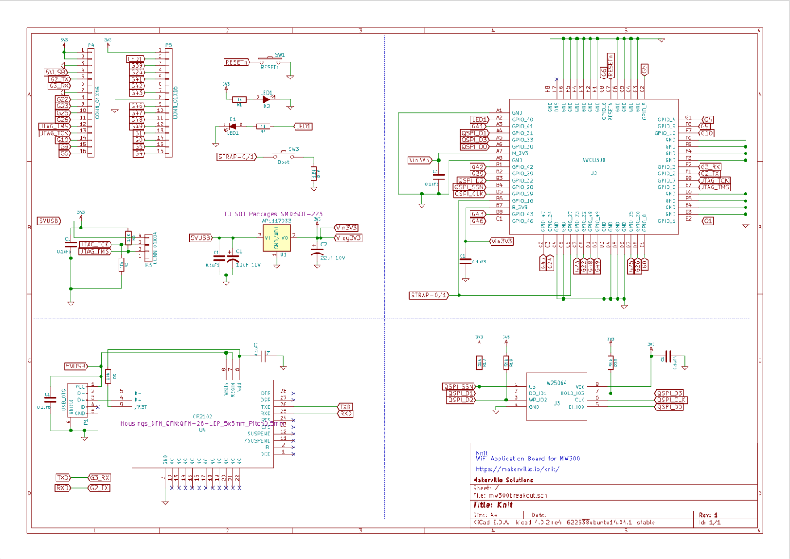

# Production

Knit is made using a Wi-Fi microcontroller which is being used in consumer and industrial applications of all sorts. Here are some tips on how took Knit from an idea to a usable development board.

## Components

## Schematics
<a href="https://github.com/Makerville/knit/raw/master/hardware/Knit/mw300breakout.pdf" target="_blank"></img></a>

## PCB files

</img>

## More

Drop us a line at [anuj@makerville.io](mailto:anuj@makerville.io) if you have any suggestions or questions !
